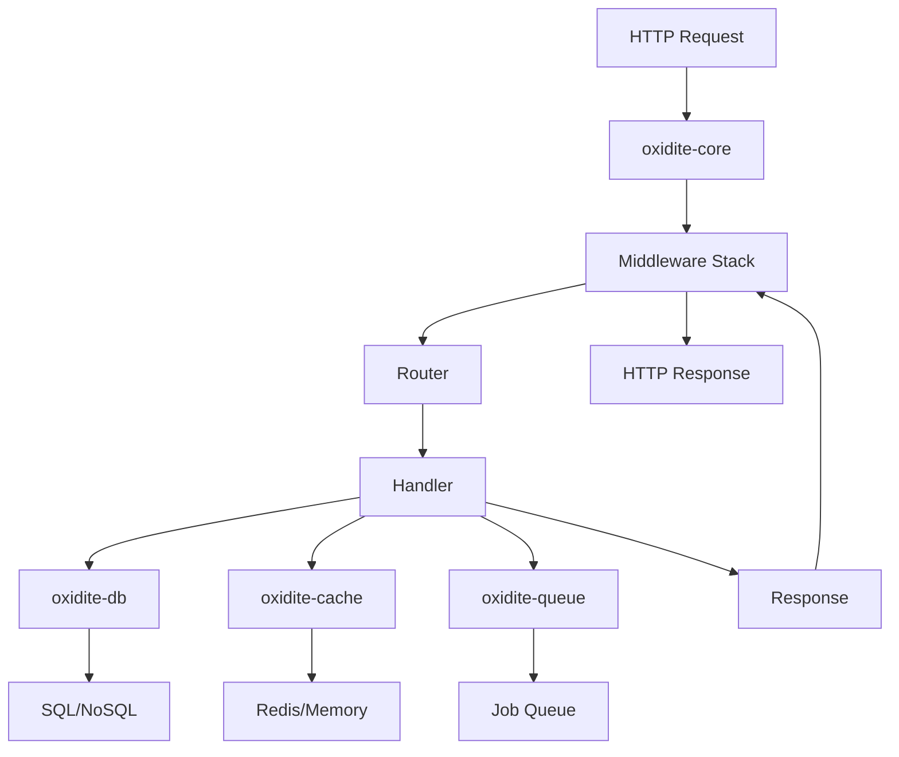
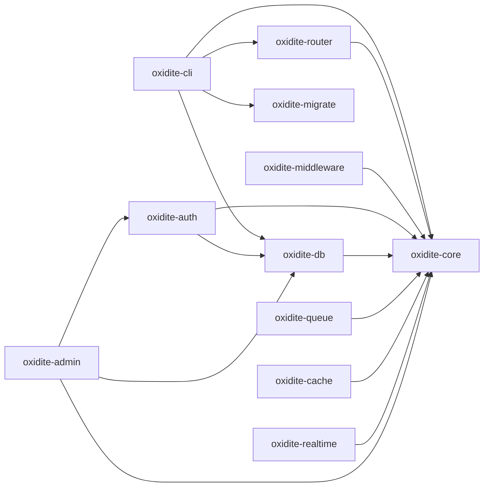

# Oxidite Architecture Overview

This document provides a comprehensive overview of Oxidite's architecture, design principles, and internal workings.

---

## 🎯 Design Principles

### 1. **Performance First**
- Zero-cost abstractions leveraging Rust's type system
- Async I/O with Tokio for maximum throughput
- Efficient memory management without garbage collection

### 2. **Security by Default**
- Secure defaults for all configurations
- Memory safety guaranteed by Rust
- Protection against OWASP Top 10 vulnerabilities
- Constant-time cryptographic operations

### 3. **Developer Ergonomics**
- Type-safe APIs that prevent runtime errors
- Comprehensive error messages
- Automatic documentation generation
- Familiar patterns from popular frameworks

### 4. **Modularity**
- Composable crates that can be used independently
- Clean separation of concerns
- Plugin architecture for extensibility

---

## 🏗️ System Architecture



---

## 📦 Crate Dependency Graph



---

## 🔄 Request Lifecycle

### 1. **Connection Accepted**
```rust
TcpListener::bind(addr).await
    -> Accept connection
    -> Spawn task
```

### 2. **HTTP Parsing**
```rust
Hyper parses HTTP request
    -> Creates Request<Body>
    -> Passes to service
```

### 3. **Middleware Processing (Pre)**
```rust
ServiceBuilder::new()
    .layer(LoggerLayer)      // Log request
    .layer(CorsLayer)        // Check CORS
    .layer(AuthLayer)        // Authenticate
    .layer(RateLimitLayer)   // Rate limit
    .service(router)
```

### 4. **Routing**
```rust
Router matches path & method
    -> Extracts path params
    -> Extracts query params
    -> Extracts body
    -> Calls handler
```

### 5. **Handler Execution**
```rust
async fn handler(Path(id): Path<i64>) -> Result<Json<User>> {
    let user = User::find(id).await?;
    Ok(Json(user))
}
```

### 6. **Middleware Processing (Post)**
```rust
Response flows back through middleware
    -> Compression
    -> Security headers
    -> Logging
```

### 7. **Response Sent**
```rust
Hyper serializes response
    -> Sends over TCP
    -> Connection closed or kept alive
```

---

## 🎨 Core Components

### oxidite-core (Implemented)

**Purpose**: HTTP server foundation, request/response handling, and routing.

**Key Types**:
- `Server`: The main HTTP server.
- `Router`: The routing engine.
- `OxiditeRequest`: A type alias for `http::Request`.
- `OxiditeResponse`: A type alias for `http::Response`.
- `Path<T>`, `Query<T>`, `Json<T>`: Extractors for typed parameters and bodies.
- `Error`: The framework's primary error type.
- `Result<T>`: A convenient `Result` type alias.

**Responsibilities**:
- TCP connection management and HTTP protocol handling (via Hyper).
- Service integration (via Tower).
- Path matching, HTTP method routing, and parameter extraction.
- Error propagation.

---

### oxidite-middleware (Implemented)

**Purpose**: Cross-cutting concerns via Tower layers

**Key Middleware**:
- `Logger`: Request/response logging
- `Cors`: CORS policy enforcement
- `Compression`: gzip/brotli response compression
- `RateLimit`: Token bucket rate limiting
- `Timeout`: Request timeout handling
- `SecurityHeaders`: CSP, HSTS, X-Frame-Options, etc.

**Architecture**:
```rust
impl<S> Service<Request> for Middleware<S> {
    type Response = Response;
    type Error = Error;
    type Future = Future;
    
    fn call(&mut self, req: Request) -> Self::Future {
        // Pre-processing
        let fut = self.inner.call(req);
        // Post-processing
    }
}
```

---

### oxidite-db (In Progress)

**Purpose**: Database abstraction and ORM

**Key Types**:
- `Database`: A connection pool to the database.
- `Model`: A trait for database models.
- `QueryBuilder`: For constructing type-safe SQL queries.

**Supported Databases**:
- PostgreSQL (via `tokio-postgres`)
- MySQL (via `mysql_async`)
- SQLite (via `rusqlite` + async wrapper)

**Architecture**:
```rust
pub trait Database: Send + Sync {
    async fn execute(&self, query: &str) -> Result<u64>;
    async fn query<T>(&self, query: &str) -> Result<Vec<T>>;
}

pub trait Model: Sized {
    fn table_name() -> &'static str;
    async fn find(id: i64, db: &Database) -> Result<Self>;
    async fn save(&mut self, db: &Database) -> Result<()>;
    async fn delete(&self, db: &Database) -> Result<()>;
}
```

---

### oxidite-auth (In Progress)

**Purpose**: Authentication and authorization

**Strategies**:
1. **JWT**: Stateless token authentication
2. **API Key**: Simple API authentication

**RBAC/PBAC**:
```rust
pub trait Authorizable {
    async fn has_role(&self, role: &str, db: &Database) -> Result<bool>;
    async fn has_permission(&self, permission: &str, db: &Database) -> Result<bool>;
}

// Middleware usage
.layer(AuthMiddleware)
.layer(RequireRole::new("admin"))
.layer(RequirePermission::new("users:delete"))
```

---

### oxidite-queue (In Progress)

**Purpose**: Background job processing

**Architecture**:
```rust
#[async_trait]
pub trait Job: Serialize + DeserializeOwned + Send + Sync {
    async fn handle(&self) -> Result<()>;
}

// Enqueue
queue.dispatch(SendEmailJob { to: "user@example.com" }).await?;

// Worker
Worker::new(queue)
    .concurrency(4)
    .run()
    .await;
```

**Backends**:
- In-memory (development)
- Redis (production)

---

### oxidite-cli (In Progress)

**Purpose**: Command-line interface

**Commands**:
- `new`: Project scaffolding
- `dev`: Development server with hot reload
- `build`: Production build
- `migrate`: Database migrations
- `make:*`: Code generation
- `queue:work`: Start queue workers

---

## 🔐 Security Architecture

### Memory Safety
- No buffer overflows (Rust prevents)
- No use-after-free (ownership system)
- No data races (borrow checker)

### Cryptography
- Argon2id for password hashing
- Constant-time comparisons
- Secure random number generation
- TLS 1.3 for transport security

### Input Validation
- Type-safe parameter extraction
- Automatic deserialization validation
- SQL injection prevention (prepared statements)
- XSS prevention (auto-escaping templates)
