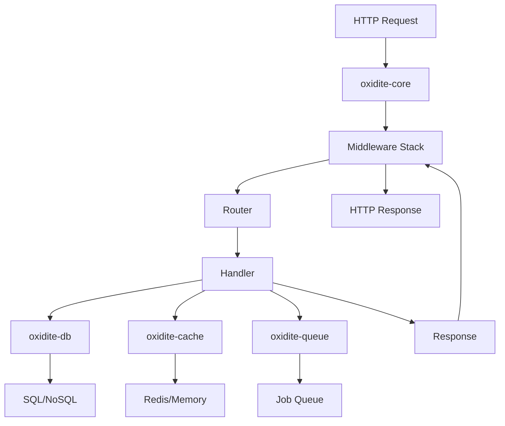
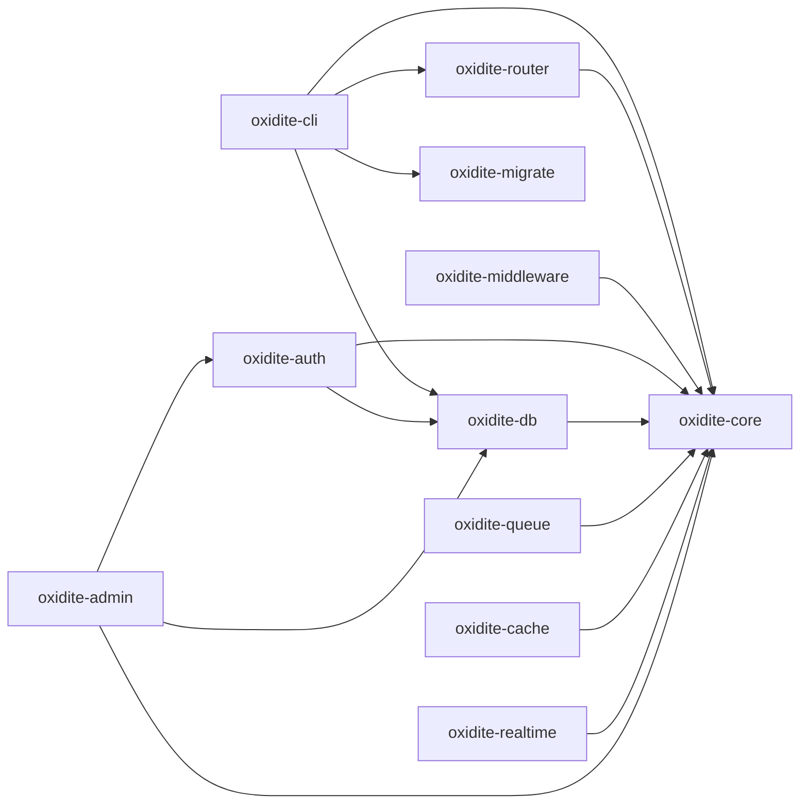

# Oxidite Architecture Overview

This document provides a comprehensive overview of Oxidite's architecture, design principles, and internal workings.

---

## 🎯 Design Principles

### 1. **Performance First**
- Zero-cost abstractions leveraging Rust's type system
- Async I/O with Tokio for maximum throughput
- Efficient memory management without garbage collection

### 2. **Security by Default**
- Secure defaults for all configurations
- Memory safety guaranteed by Rust
- Protection against OWASP Top 10 vulnerabilities
- Constant-time cryptographic operations

### 3. **Developer Ergonomics**
- Type-safe APIs that prevent runtime errors
- Comprehensive error messages
- Automatic documentation generation
- Familiar patterns from popular frameworks

### 4. **Modularity**
- Composable crates that can be used independently
- Clean separation of concerns
- Plugin architecture for extensibility

---

## 🏗️ System Architecture



---

## 📦 Crate Dependency Graph



---

## 🔄 Request Lifecycle

### 1. **Connection Accepted**
```rust
TcpListener::bind(addr).await
    -> Accept connection
    -> Spawn task
```

### 2. **HTTP Parsing**
```rust
Hyper parses HTTP request
    -> Creates Request<Body>
    -> Passes to service
```

### 3. **Middleware Processing (Pre)**
```rust
ServiceBuilder::new()
    .layer(LoggerLayer)      // Log request
    .layer(CorsLayer)        // Check CORS
    .layer(AuthLayer)        // Authenticate
    .layer(RateLimitLayer)   // Rate limit
    .service(router)
```

### 4. **Routing**
```rust
Router matches path & method
    -> Extracts path params
    -> Extracts query params
    -> Extracts body
    -> Calls handler
```

### 5. **Handler Execution**
```rust
async fn handler(params: Path<UserId>) -> Result<Json<User>> {
    let user = User::find(params.id).await?;
    Ok(Json(user))
}
```

### 6. **Middleware Processing (Post)**
```rust
Response flows back through middleware
    -> Compression
    -> Security headers
    -> Logging
```

### 7. **Response Sent**
```rust
Hyper serializes response
    -> Sends over TCP
    -> Connection closed or kept alive
```

---

## 🎨 Core Components

### oxidite-core

**Purpose**: HTTP server foundation and request/response handling

**Key Types**:
- `Server<S>`: Generic HTTP server accepting any Tower service
- `OxiditeRequest`: Alias for `Request<Incoming>`
- `OxiditeResponse`: Alias for `Response<BoxBody>`
- `Error`: Common error type
- `Result<T>`: Common result type

**Responsibilities**:
- TCP connection management
- HTTP protocol handling (via Hyper)
- Service integration (via Tower)
- Error propagation

---

### oxidite-router

**Purpose**: Request routing and parameter extraction

**Key Types**:
- `Router`: Main routing struct implementing `Service`
- `Handler`: Trait for route handlers
- `Path<T>`: Extract typed path parameters
- `Query<T>`: Extract typed query parameters
- `Json<T>`: Extract/return JSON bodies
- `RouteGroup`: Group routes with shared middleware

**Responsibilities**:
- Path matching (exact, params, wildcards)
- HTTP method routing
- Parameter extraction and validation
- Route grouping
- OpenAPI spec generation

---

### oxidite-middleware

**Purpose**: Cross-cutting concerns via Tower layers

**Key Middleware**:
- `Logger`: Request/response logging
- `Cors`: CORS policy enforcement
- `Compression`: gzip/brotli response compression
- `RateLimit`: Token bucket rate limiting
- `Timeout`: Request timeout handling
- `SecurityHeaders`: CSP, HSTS, X-Frame-Options, etc.

**Architecture**:
```rust
impl<S> Service<Request> for Middleware<S> {
    type Response = Response;
    type Error = Error;
    type Future = Future;
    
    fn call(&mut self, req: Request) -> Self::Future {
        // Pre-processing
        let fut = self.inner.call(req);
        // Post-processing
    }
}
```

---

### oxidite-db

**Purpose**: Database abstraction and ORM

**Key Types**:
- `Connection`: Database connection trait
- `QueryBuilder`: Type-safe query construction
- `Model`: Trait for database models
- `Transaction`: Transaction handling

**Supported Databases**:
- PostgreSQL (via `tokio-postgres`)
- MySQL (via `mysql_async`)
- SQLite (via `rusqlite` + async wrapper)
- MongoDB (via `mongodb`)
- Redis (via `redis-rs`)

**Architecture**:
```rust
pub trait Database: Send + Sync {
    async fn execute(&self, query: &str) -> Result<u64>;
    async fn query<T>(&self, query: &str) -> Result<Vec<T>>;
}

pub trait Model: Sized {
    fn table_name() -> &'static str;
    async fn find(id: impl Into<Id>) -> Result<Self>;
    async fn create(self) -> Result<Self>;
    async fn update(&self) -> Result<()>;
    async fn delete(&self) -> Result<()>;
}
```

---

### oxidite-migrate

**Purpose**: Database schema migrations

**Key Concepts**:
- **Up migrations**: Apply schema changes
- **Down migrations**: Rollback schema changes
- **Auto-diffing**: Generate migrations from model changes
- **History tracking**: Track applied migrations

**Migration Format**:
```rust
pub struct Migration {
    pub version: String,
    pub up: Box<dyn Fn(&Connection) -> BoxFuture<Result<()>>>,
    pub down: Box<dyn Fn(&Connection) -> BoxFuture<Result<()>>>,
}
```

---

### oxidite-auth

**Purpose**: Authentication and authorization

**Strategies**:
1. **Session**: Cookie-based sessions
2. **JWT**: Stateless token authentication
3. **Paseto**: Modern token alternative
4. **OAuth2**: Third-party authentication
5. **API Key**: Simple API authentication

**RBAC/PBAC**:
```rust
pub trait Authorizable {
    fn has_role(&self, role: &str) -> bool;
    fn can(&self, permission: &str) -> bool;
}

// Middleware usage
.layer(RequireAuth::new())
.layer(RequireRole::new("admin"))
.layer(RequirePermission::new("users:delete"))
```

---

### oxidite-queue

**Purpose**: Background job processing

**Architecture**:
```rust
pub trait Job: Serialize + DeserializeOwned + Send + Sync {
    async fn perform(&self) -> Result<()>;
    fn max_retries(&self) -> u32 { 3 }
    fn backoff(&self) -> Duration { Duration::from_secs(60) }
}

// Enqueue
SendEmailJob { to: "user@example.com" }
    .delay(Duration::from_secs(300))
    .enqueue()
    .await?;

// Worker
Queue::new()
    .worker_count(4)
    .start()
    .await;
```

**Backends**:
- In-memory (development)
- Redis (production)
- PostgreSQL (production)

---

### oxidite-cache

**Purpose**: Multi-layer caching

**Architecture**:
```rust
pub trait Cache: Send + Sync {
    async fn get<T>(&self, key: &str) -> Result<Option<T>>;
    async fn set<T>(&self, key: &str, value: &T, ttl: Duration) -> Result<()>;
    async fn delete(&self, key: &str) -> Result<()>;
    async fn flush(&self) -> Result<()>;
}

// Usage
cache.remember("user:123", Duration::from_secs(300), || async {
    User::find(123).await
}).await?;
```

---

### oxidite-realtime

**Purpose**: WebSockets and pub/sub

**Architecture**:
```rust
// WebSocket handler
router.ws("/ws", |socket: WebSocket| async move {
    socket.join("room:lobby").await;
    
    while let Some(msg) = socket.recv().await {
        socket.broadcast("room:lobby", msg).await;
    }
});

// Broadcasting
Broadcast::to_channel("notifications")
    .send(json!({ "type": "new_message" }))
    .await;
```

---

### oxidite-cli

**Purpose**: Command-line interface

**Commands**:
- `new`: Project scaffolding
- `dev`: Development server with hot reload
- `build`: Production build
- `migrate`: Database migrations
- `make:*`: Code generation
- `queue:work`: Start queue workers
- `test`: Run test suite

**Implementation**:
```rust
#[derive(Parser)]
enum Commands {
    New { name: String },
    Dev { port: u16 },
    Migrate,
    // ...
}
```

---

## 🔐 Security Architecture

### Memory Safety
- No buffer overflows (Rust prevents)
- No use-after-free (ownership system)
- No data races (borrow checker)

### Cryptography
- Argon2id for password hashing
- Constant-time comparisons
- Secure random number generation
- TLS 1.3 for transport security

### Input Validation
- Type-safe parameter extraction
- Automatic deserialization validation
- SQL injection prevention (prepared statements)
- XSS prevention (auto-escaping templates)

### CSRF Protection
- Token generation and validation
- SameSite cookie attribute
- Double-submit cookie pattern

### Rate Limiting
- Token bucket algorithm
- Per-IP and per-user limits
- Distributed via Redis

---

## ⚡ Performance Optimizations

### Async I/O
- Non-blocking I/O for all operations
- Efficient task scheduling with Tokio
- Connection pooling for databases

### Zero-Copy
- Body streaming without buffering
- Efficient serialization with serde

### Caching
- Response caching middleware
- Database query result caching
- Static file caching

### Connection Pooling
- Database connection pools (bb8/deadpool)
- Redis connection pools
- HTTP/2 connection reuse

---

## 🧪 Testing Strategy

### Unit Tests
- Test individual functions
- Mock external dependencies
- Fast execution

### Integration Tests
- Test full request/response cycle
- Use test database
- Reset state between tests

### Load Tests
- Benchmark throughput
- Identify bottlenecks
- Wrk/Bombardier integration

### Fuzz Testing
- Discover edge cases
- cargo-fuzz integration
- Continuous fuzzing

---

## 📈 Monitoring & Observability

### Logging
- Structured JSON logging
- Log levels (trace, debug, info, warn, error)
- Request ID tracking

### Metrics
- Prometheus metrics
- Request duration histograms
- Database query metrics
- Queue depth metrics

### Tracing
- Distributed tracing with OpenTelemetry
- Span creation for each layer
- Trace context propagation

---

## 🚀 Deployment Architecture

### Single Server
```
[Load Balancer]
      |
[Oxidite Server]
      |
   [Database]
```

### Horizontal Scaling
```
[Load Balancer]
      |
   [Oxidite Server 1] [Oxidite Server 2] [Oxidite Server N]
      |                     |                     |
      +---------------------+---------------------+
                            |
                    [Shared Database]
                    [Shared Redis]
```

### Microservices
```
[API Gateway]
      |
      +-- [Auth Service]
      +-- [User Service]
      +-- [Order Service]
      |
[Service Mesh]
      |
[Shared Infrastructure]
```

---

## 🔮 Future Directions

- GraphQL support
- gRPC native support
- Hot reloading in production
- Built-in service discovery
- Distributed tracing
- Machine learning integration
- Serverless deployment

---

This architecture is designed to be **fast**, **secure**, **scalable**, and **maintainable**. Every design decision prioritizes these goals while maintaining developer ergonomics.
